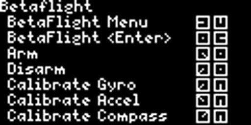
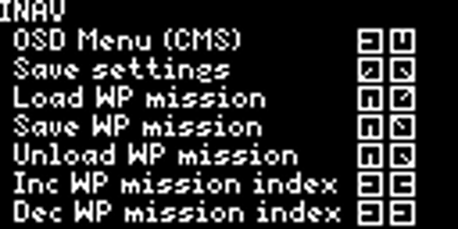
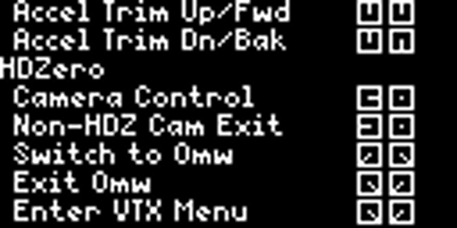
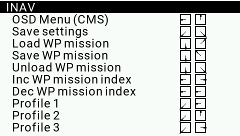

# Stick commands for TBS Mambo / Tango 2, and TX16s for OpenTX and EdgeTX
This is a simple but useful Lua script written for the TBS Mambo and Tango 2 radios, as well as an OpenTx and EdgeTx version for the TX16S style radios. Inspired by Lee Schofield's (Painless360) video demonstrating OpenTx's ability to display model comments, the script's sole purpose is to simply provide a scrollable list of common stick commands for Betaflight, HDZero and INAV.  The script is intentionally simple so that non-programmers can feel free to tinker with it, add new sticks command, and otherwise improve it. You can download the script for the Mambo/Tango 2 [here](https://github.com/DHaacke/Mambo-Tango/blob/master/sticks.lua), and for the TX16S running OpenTx [here](https://github.com/DHaacke/Mambo-Tango/blob/master/tx16stk.lua), and for TX16S running EdgeTx [here](https://github.com/DHaacke/Mambo-Tango/blob/master/tx16etx.lua)

 Be sure to visit's Painless360's site for some excellent content at [Painless360](https://www.youtube.com/channel/UCp1vASX-fg959vRc1xowqpw)

 # Examples (partial list)
 
 ## Mambo
 
 
 

 ## TX16s
 

## Author
Doug Haacke lives in Billings, Montana and is a lifelong aviation enthusiast and RC pilot, ardent fly fisherman, and senior software developer by trade.

Special credit to `Andrzej Roszkowski` for the EdgeTx support!!

## Installation

Download and copy the `sticks.lua` script for Mambo/Tango 2, `tx16stk.lua` for the TX16S on OpenTx, or `tx16etx.lua` for the TX16S on EdgeTx into your /SCRIPTS/TELEMETRY folder on your radio.  Once copied, you can run the script one of two ways:

1. The preferred method is to add the script to your DISPLAY items, so it can be accessed much more quickly. To add it, click the Menu button to get into Model settings. Tap the Menu botton until you reach the DISPLAY tab. Select an empty row, set the type to SCRIPT, and then from the list of scripts choose your desired script.  Once done, you can easily run the script by long pressing the Page button to bring up the scripts and tapping Page, which will cycle through the scripts you've set up. To exit the Telemetry screen, long press the Exit button.  Lee's excellent video demonstrates how to easily do this.

2. Long press on the Menu button, click Page (for the SD card browser), scroll down to `[SCRIPTS]`, then scroll down to `[TELEMETRY]`, select your desired script, then long press the jog wheel and select Execute.

## Usage

Once you have the script running on your radio, use the jog wheel to scroll through the items. If you tap the menu button on the Mambo (or the press the jog wheel on the TX16s), the list will reset back to your starting point.

If you'd like to change the starting point, open the script in a text editor and look for the line near the top that says "local currentRow = 1". Simply change the value to one of three values:  1 for Betaflight, 14 for HDZero or 20 for INAV.  Save the file back to your radio and you're all set!

## Comments and Feedback

Constructive comments and feedback are always welcome. I'll try and keep the readme updated as changes occur.
